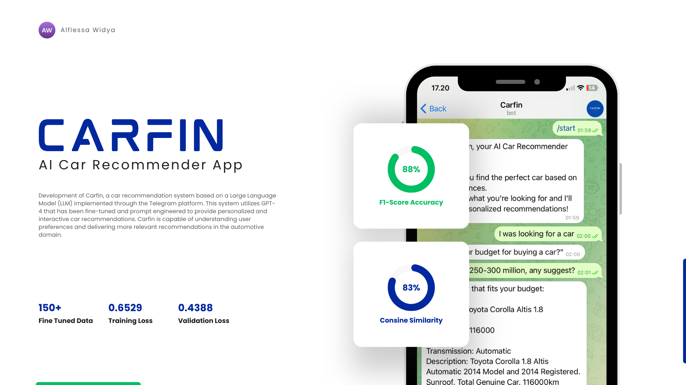

# **Car Recommender System Based on Conversational Recommender System Using Large Language Model**

**Carfin** is a car recommendation system built on top of a Large Language Model (LLM) and deployed via the Telegram platform.  
This project leverages **GPT-4**, fine-tuned with a domain-specific conversational dataset and enhanced through **prompt engineering** to provide accurate and context-aware car recommendations.

### 🧠 Key Features
- Fine-tuned GPT-4 model for the automotive domain  
- Integrated into Telegram for real-time interaction  
- Personalized recommendation flow based on user conversation  
- Enhanced with **BERT + Cosine Similarity** for response evaluation  
- Focused on understanding user preferences naturally through chat

### 🎯 Purpose
This project was developed as part of my undergraduate research and portfolio to explore how LLMs can be applied in **Conversational Recommender Systems** (CRS), specifically in the context of the automotive market.

### 🛠️ Tech Stack
- Python (backend + LLM integration)
- OpenAI GPT-4 API
- Telegram Bot API
- BERT for relevance evaluation
- Pandas + JSON for data management

---

📫 **Interested in working together or learning more?**  
Feel free to reach out and [visit my LinkedIn profile](https://www.linkedin.com/in/alfiessa) for more info and updates.
